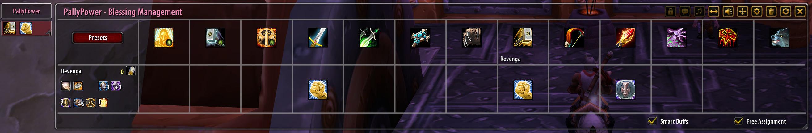

# PallyPowerVanilla v1.6.2

PallyPowerVanilla is a modernised, compatibility-focused fork of **PallyPower** for World of Warcraft 1.12.1

The aim is to preserve the familiar PallyPower experience and compatibility with existing versions while improving the addon for modern Vanilla clients and servers.

## Project Goals

- **Modernisation** — improve PallyPower without changing what makes it PallyPower, with a cleaner interface and less reliance on inherited hardcoded behaviour.
- **Compatibility** — support a broad range of World of Warcraft 1.12.1-based clients and servers while retaining compatibility with the existing PallyPower ecosystem.

## Fork Changes

- **Refactor** - Refactoring decades of development into (hopefully) a more logical, easy to use structure. XML rewritten, LUA brought into one file.
- **BuffBar UI** — Updated with cleaner buttons, horizontal layout now rotates blessing buttons so it fits on screen, new button artwork, verbose toggle added. Using PallyPower no longer cancels autoattack.
- **Blessing Management UI** - Reorganised blessing/aura/symbol layout
- **Dynamic Blessing data** — Blessing durations, mana costs, range, ranks and improvement talents are determined from the player's learned spells rather than hardcoded values.
- **Self Buffs** - now also highlight red when missing, and update on event rather than the internal scan frequency.
- **Righteous Fury** - is now assignable per-paladin, still hidable.
- **Optional .dll enhancements** — nampower and unitxp_sp3 are supported optionally, enabled if found and report detection success/failure in advanced settings

## How to Use

PallyPowerVanilla works like PallyPower. Existing users should find the assignment system immediately familiar, including communication with compatible older versions of PallyPower.

- **Left-click** a blessing to cast a Greater Blessing.
- **Right-click** to cast a normal Blessing.
- **Middle-click** a player in Blessing Management to mark them as a tank.
- Common options are presented visually in the main interfaces, with less frequently used settings grouped under **Advanced Options**.

## Credits

PallyPowerVanilla builds on many years of PallyPower development.

**Original PallyPower:**  
Sneakyfoot, Aznamir, Gnarf, Blackoz and contributors.

**Vanilla / Turtle WoW development:**  
CosminPOP, Azgaardian, madScripting, ivanovlk, TheRealFayz and other contributors.

**PallyPowerVanilla:**  
Seraphic8x2244

Development of PallyPowerVanilla makes use of AI-assisted coding.
